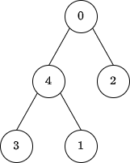

# Coins

You are given a tree with $n$ nodes numbered from $0$ to $n-1$, in which node $0$ is the root of the tree. You have $k$ coins, with which you play the following single-player game. In each round of the game, you select a node, you remove a coin from each of its children, and you place a coin on the selected node. You can do this only if all of the children have at least one coin on them. (If the selected node has no children, then there is no such restriction.) You are allowed to reuse the coins that are removed, even in the same round. At the very beginning of the game the nodes do not have any coins on them.

The task is to calculate the minimum number of coins $k$ that are necessary to place a coin on node $0$. The number of rounds that you play does not matter.

For example, consider the following tree, with $n=5$:

In this case, the minimum number of coins necessary to put a coin on the root is $2$. One sequence of selected nodes that achieves this is: $3$, $1$, $4$ (this removes a coin from node $3$ and a coin from node $1$), $2$, $0$ (this removes a coin from node $4$ and a coin from node $2$). This strategy only needs $2$ coins: for example, when you select node $0$, you first remove one coin from each of its two children, so you can place one of these coins on node $0$.

Implement the method "getMinCoins". You are free to create auxiliary methods.

You get one point for each passing test set. To pass both test sets correctly, your solution is expected to run in at most $O(n \log n)$ time.

**Hint**: use depth-first search and dynamic programming.
